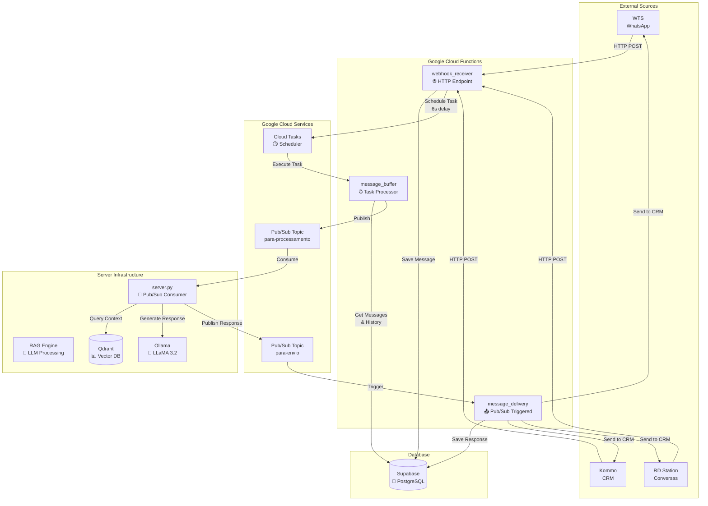

# 🧠 Hibrid RAG - Sistema Híbrido de Conversas Inteligentes

Um sistema completo de processamento de mensagens com **Retrieval-Augmented Generation (RAG)** que integra múltiplos CRMs e fornece respostas contextualizadas via IA.

## 🏗️ Arquitetura

### 📊 Visão Geral
```
CRMs → Cloud Functions → Pub/Sub → Servidor RAG → Cloud Functions → CRMs
```

O sistema é composto por **3 camadas principais**:

1. **🌐 Cloud Functions**: Entrada, buffer e entrega de mensagens
2. **🧠 Servidor RAG**: Processamento inteligente com LLM + Vector Database  
3. **📗 Supabase**: Persistência e histórico de conversas

### 🔄 Fluxo Completo



## 🚀 Início Rápido

### 📋 Pré-requisitos

- **Docker & Docker Compose**
- **Python 3.11+** (para desenvolvimento local)
- **Google Cloud SDK** (para deploy das cloud functions)
- **Node.js** (para algumas ferramentas)

### ⚡ Setup com Docker (Recomendado)

```bash
# 1. Clone o repositório
git clone <url-do-repo>
cd hibrid-rag

# 2. Configure as variáveis de ambiente
cp server/.env.example server/.env
# Edite server/.env com suas configurações

# 3. Inicie todo o ambiente
cd server
docker-compose up -d

# 4. Carregue conhecimento inicial
python scripts/load_knowledge.py examples
```

### 🛠️ Setup Manual

```bash
# 1. Instalar dependências do servidor
cd server
pip install -r requirements.txt

# 2. Iniciar serviços externos
# Qdrant
docker run -p 6333:6333 qdrant/qdrant

# Ollama
docker run -p 11434:11434 ollama/ollama
docker exec -it <container> ollama pull llama3.2

# 3. Iniciar servidor
python server.py
```

## ⚙️ Configuração

### 🔑 Variáveis de Ambiente

Crie um arquivo `.env` no diretório `server/`:

```bash
# Ollama (LLM)
OLLAMA_MODEL=llama3.2
OLLAMA_HOST=localhost
OLLAMA_PORT=11434

# Qdrant (Vector Database)  
QDRANT_HOST=localhost
QDRANT_PORT=6333

# Google Cloud
GOOGLE_PROJECT_ID=seu-projeto-gcp
PUBSUB_SUBSCRIPTION_NAME=para-processamento-sub
PUBSUB_TOPIC_TO_SEND=para-envio
PUBSUB_TOPIC_TO_PROCESS=para-processamento

# Supabase
SUPABASE_URL=https://seu-projeto.supabase.co
SUPABASE_ANON_KEY=sua-chave-anonima

# CRM APIs
WTS_API_TOKEN=seu-token-wts
KOMMO_API_TOKEN=seu-token-kommo
RD_API_TOKEN=seu-token-rd
```

### 🗄️ Setup do Banco (Supabase)

Execute o SQL em `server/scripts/supabase_setup.sql` no seu projeto Supabase:

```sql
-- Criar tabelas conversations e messages
-- Ver arquivo completo em server/scripts/supabase_setup.sql
```

## 📦 Componentes

### 🌐 Cloud Functions

| Função | Responsabilidade | Trigger |
|--------|------------------|---------|
| **webhook_receiver** | Recebe webhooks de CRMs | HTTP POST |
| **message_buffer** | Agrupa mensagens (6s delay) | Cloud Tasks |
| **message_delivery** | Entrega respostas aos CRMs | Pub/Sub |

#### Deploy das Cloud Functions:

```bash
# Webhook Receiver
cd cloud_functions/webhook_receiver
gcloud functions deploy webhook_receiver \
  --runtime python311 \
  --trigger-http \
  --allow-unauthenticated

# Message Buffer
cd cloud_functions/message_buffer  
gcloud functions deploy message_buffer \
  --runtime python311 \
  --trigger-http

# Message Delivery
cd cloud_functions/message_delivery
gcloud functions deploy message_delivery \
  --runtime python311 \
  --trigger-topic para-envio
```

### 🧠 Servidor RAG

O servidor processa mensagens usando:

- **🤖 Ollama**: LLM (LLaMA 3.2) para geração de respostas
- **📊 Qdrant**: Vector database para busca semântica
- **🔍 SentenceTransformers**: Embeddings (`all-MiniLM-L6-v2`)

```bash
# Iniciar servidor
cd server
python server.py

# Health check
python scripts/health_check.py

# Monitor em tempo real
python scripts/monitor_server.py
```

## 📚 Gerenciamento de Conhecimento

### 🎯 Script Unificado

```bash
# Ver exemplos
python scripts/load_knowledge.py examples

# Carregar de arquivo
python scripts/load_knowledge.py file documents.txt

# Carregar de diretório recursivo
python scripts/load_knowledge.py file knowledge/ --recursive

# Carregar do Supabase
python scripts/load_knowledge.py supabase articles content

# Carregar de URL
python scripts/load_knowledge.py url https://docs.exemplo.com

# Ver informações da base
python scripts/load_knowledge.py info

# Limpar base
python scripts/load_knowledge.py clear
```

### 📁 Scripts Especializados

- **`load_knowledge_from_files.py`**: TXT, JSON, CSV, Markdown
- **`load_knowledge_from_database.py`**: Supabase, PostgreSQL, SQLite  
- **`load_knowledge_from_web.py`**: URLs, RSS, Sitemaps
- **`load_knowledge_from_env.py`**: Variáveis de ambiente

## 🔌 Integrações CRM

### WhatsApp (WTS)
```bash
# Webhook URL
https://region-project.cloudfunctions.net/webhook_receiver/wts

# Headers necessários
x-wts-signature: sua-assinatura
```

### Kommo (AmoCRM)
```bash
# Webhook URL  
https://region-project.cloudfunctions.net/webhook_receiver/kommo

# Headers necessários
x-kommo-signature: sua-assinatura
```

### RD Station Conversas
```bash
# Webhook URL
https://region-project.cloudfunctions.net/webhook_receiver/rd

# Headers necessários
x-rd-signature: sua-assinatura
```

## 🩺 Monitoramento

### 📊 Health Checks

```bash
# Check completo do sistema
python scripts/health_check.py

# Monitor contínuo (atualizações a cada 30s)
python scripts/monitor_server.py

# Health check específico via Docker
./scripts/docker_health_check.sh
```

### 📈 Logs e Métricas

- **Servidor**: Logs detalhados de processamento RAG
- **Cloud Functions**: Logs no Google Cloud Console
- **Supabase**: Queries e performance no dashboard

## 🔧 Desenvolvimento

### 🧪 Testes

```bash
# Teste conexões
python -c "from core.config import get_rag_system; print('✅ Imports OK')"

# Teste Qdrant
curl http://localhost:6333/health

# Teste Ollama  
curl http://localhost:11434/api/tags

# Notebook de testes
jupyter notebook tests/teste.ipynb
```

### 🐛 Troubleshooting

| Problema | Solução |
|----------|---------|
| **Import circular** | Usar lazy loading nas funções |
| **Qdrant não conecta** | Verificar se está rodando na porta 6333 |
| **Ollama timeout** | Verificar modelo baixado: `ollama list` |
| **Pub/Sub erro** | Verificar credenciais Google Cloud |
| **CRM API falha** | Verificar tokens e rate limits |

## 📁 Estrutura do Projeto

### 🎯 Visão Geral

O projeto foi reorganizado para ter uma estrutura mais simples e plana, com todas as Cloud Functions na raiz do projeto. Isso facilita o gerenciamento e deploy.

### 📂 Estrutura de Arquivos

```
hibrid-rag-functions/
├── 🌐 Cloud Functions (na raiz)
│   ├── message_receiver_main.py          # Função principal do message receiver
│   ├── message_receiver_Dockerfile       # Container Docker
│   │
│   ├── message_buffer_main.py            # Função principal do buffer
│   ├── message_buffer_Dockerfile         # Container Docker
│   │
│   ├── message_delivery_main.py          # Função principal de entrega
│   └── message_delivery_Dockerfile       # Container Docker
│
├── 🔧 Módulos Compartilhados
│   ├── models.py                         # Modelos de dados (compartilhado)
│   ├── supabase.py                       # Gerenciador Supabase (compartilhado)
│   └── message_processor.py              # Processador de webhooks e entrega (compartilhado)
│
├── 📦 Requirements
│   └── requirements.txt                  # Dependências unificadas
│
├── 🔧 Scripts de Deploy
│   ├── deploy_functions.bat              # Deploy para Windows
│   └── deploy_functions.sh               # Deploy para Linux/Mac
│
├── 📄 Documentação
│   ├── README.md                         # Documentação principal
│   └── Multi Tenant TO-DO.md             # Roadmap multi-tenant
│
├── 🔐 Configuração
│   ├── service-account.json              # Credenciais Google Cloud
│   ├── .gitignore                        # Arquivos ignorados pelo Git
│   └── .gcloudignore                     # Arquivos ignorados pelo Cloud Build
│
└── 📁 Outros
    └── .setup/                           # Arquivos de setup
```

### 🚀 Como Usar

#### Deploy das Cloud Functions

##### Windows:
```bash
deploy_functions.bat [PROJECT_ID]
```

##### Linux/Mac:
```bash
chmod +x deploy_functions.sh
./deploy_functions.sh [PROJECT_ID]
```

#### Deploy Manual

##### Message Receiver:
```bash
gcloud functions deploy message-receiver \
    --runtime python311 \
    --trigger-http \
    --allow-unauthenticated \
    --entry-point message_receiver \
    --source . \
    --project [PROJECT_ID]
```

##### Message Buffer:
```bash
gcloud functions deploy message-buffer \
    --runtime python311 \
    --trigger-http \
    --entry-point message_buffer \
    --source . \
    --project [PROJECT_ID]
```

##### Message Delivery:
```bash
gcloud functions deploy message-delivery \
    --runtime python311 \
    --trigger-topic para-envio \
    --entry-point message_delivery \
    --source . \
    --project [PROJECT_ID]
```

### 🔧 Desenvolvimento Local

#### Testando Individualmente

##### Message Receiver:
```bash
# Instalar dependências
pip install -r requirements.txt

# Executar localmente
functions-framework --target=message_receiver --port=8080
```

##### Message Buffer:
```bash
# Instalar dependências
pip install -r requirements.txt

# Executar localmente
functions-framework --target=message_buffer --port=8081
```

##### Message Delivery:
```bash
# Instalar dependências
pip install -r requirements.txt

# Executar localmente
functions-framework --target=message_delivery --port=8082
```

#### Docker

##### Message Receiver:
```bash
docker build -f message_receiver_Dockerfile -t message-receiver .
docker run -p 8080:8080 message-receiver
```

##### Message Buffer:
```bash
docker build -f message_buffer_Dockerfile -t message-buffer .
docker run -p 8081:8080 message-buffer
```

##### Message Delivery:
```bash
docker build -f message_delivery_Dockerfile -t message-delivery .
docker run -p 8082:8080 message-delivery
```

### 📝 Convenções de Nomenclatura

#### Arquivos Python
- `[function]_main.py` - Função principal
- `models.py` - Modelos Pydantic (compartilhado)
- `supabase.py` - Gerenciador Supabase (compartilhado)
- `message_processor.py` - Processador de webhooks e entrega (compartilhado)

#### Arquivos de Configuração
- `requirements.txt` - Dependências Python unificadas
- `[function]_Dockerfile` - Container Docker

#### Funções
- `message_receiver` - Recebe mensagens
- `message_buffer` - Processa buffer
- `message_delivery` - Entrega mensagens

### 🔄 Fluxo de Dados

```
1. CRM → message_receiver_main.py
2. message_receiver → message_buffer_main.py (via Cloud Tasks)
3. message_buffer → Pub/Sub → message_delivery_main.py
4. message_delivery → CRM
```

### ✅ Vantagens da Nova Estrutura

1. **Simplicidade**: Todos os arquivos na raiz
2. **Facilidade de Deploy**: Scripts automatizados
3. **Isolamento**: Cada função tem seus próprios arquivos
4. **Manutenibilidade**: Estrutura clara e organizada
5. **Escalabilidade**: Fácil adicionar novas funções

### 🚨 Importante

- **Módulos Compartilhados**: `models.py`, `supabase.py` e `message_processor.py` são compartilhados entre todas as funções
- **Requirements Unificados**: Todas as funções usam o mesmo arquivo `requirements.txt` com todas as dependências
- **Imports Atualizados**: Todos os imports apontam para os módulos compartilhados
- **Dockerfiles Otimizados**: Copiam apenas os arquivos necessários para cada função
- **Service Account**: O `service-account.json` é compartilhado entre todas as funções

## 🔒 Segurança

- **Autenticação**: Tokens API para cada CRM
- **Validação**: Schemas Pydantic em todas as interfaces  
- **Isolamento**: Container Docker com usuário não-root
- **Logs**: Sem exposição de tokens ou dados sensíveis
- **Network**: Comunicação interna via Pub/Sub

## 📊 Performance

### 🚀 Otimizações

- **Lazy Loading**: Imports sob demanda
- **Connection Pooling**: Reutilização de conexões
- **Batch Processing**: Múltiplas mensagens por publicação
- **Async Processing**: Operações não-bloqueantes
- **Caching**: HuggingFace models em volume persistente

### 📈 Métricas Esperadas

- **Latência**: < 2s para respostas simples
- **Throughput**: 100+ mensagens/minuto
- **Uptime**: 99.9% com health checks
- **Memory**: ~1.5GB por instância do servidor

## 🤝 Contribuição

### 🔄 Workflow

1. **Fork** o repositório
2. **Crie** uma branch: `git checkout -b feature/nova-funcionalidade`
3. **Commit** suas mudanças: `git commit -m 'feat: adicionar nova funcionalidade'`
4. **Push** para a branch: `git push origin feature/nova-funcionalidade`  
5. **Abra** um Pull Request

### 📋 Convenções

- **Commits**: Conventional Commits (`feat:`, `fix:`, `docs:`)
- **Code Style**: Black + isort para Python
- **Tests**: Pytest para testes unitários
- **Docs**: Docstrings em português, README em markdown

## 📄 Licença

Este projeto está sob a licença **MIT**. Veja o arquivo `LICENSE` para detalhes.

## 🆘 Suporte

- **📧 Email**: [seu-email@exemplo.com]
- **💬 Discord**: [link-do-discord]
- **🐛 Issues**: [GitHub Issues](link-para-issues)
- **📖 Docs**: [Documentação Completa](link-para-docs)

---

**💡 Tip**: Use o script unificado `load_knowledge.py` para 90% dos casos de carregamento de conhecimento. Scripts especializados apenas para necessidades avançadas!

**🎉 Desenvolvido com ❤️ para automatizar conversas inteligentes**